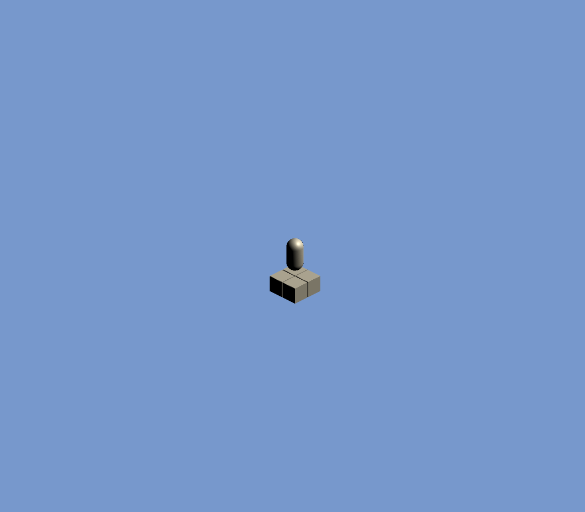
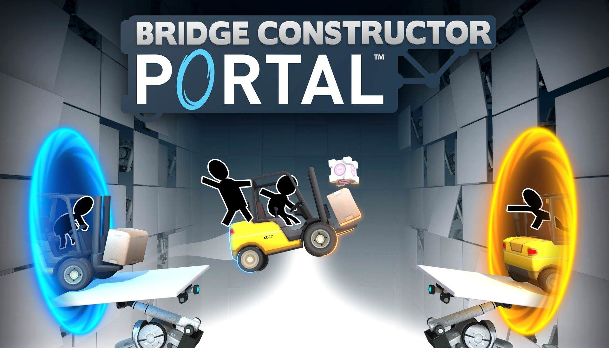

# Log 1
Session Start: `04-05-20 15:38`
Session End: `04-05-20 19:27`
Time: `4:11`
---
# What I Did

This session was mostly one to toy around with ideas and come up with what I'm beginning to design. A game design document has not yet been created (since this is a brand new idea that I'm toying with), and I lost passion with continuing on Rhythm-Intersect due to the lack of resources surrounding rhythm games and their creation. REACTOR is a new game idea which is a puzzle game rather than a rhythm game.

REACTOR (name is still iffy, part of the creative process) is a puzzle game where you push around batteries to power outlets/reactors/other-thing-that-consumes-power. The only way you can interact with batteries is by pushing them and thus, you must rely on other machinery to move batteries around or do more interesting stuff with them. I've come up with some machines and their gimmick and how they'll be woven into the puzzle.

One of these machines is the very simple wire. The wire connects an input node to an output node. The purpose of wires is to transfer energy from one place to another; if you put a battery on an input node, the wire will transfer the battery's power to the output (which may be a reactor or another machine). The gimmick of wires is that they'll kill the player if touched while active (i.e. while a battery with power sits on the input node).

Another machine idea is the piston. The piston can push an object in front of it in the direction it's facing. If you're familiar with Minecraft, this machine acts the same as that. Pistons can be used to push around batteries, but they can push other objects as well (including the player themselves).

There are more machine ideas that I've cooked up, but their concepts and gimmicks need to be built upon further (elevators, lasers, mirrors, lights).

In terms of _actually doing things_, I've set up the scene (i.e. messed around with camera properties) to create and begin the aesthetic of the game.

My end goal is to replicate the aesthetic of Bridge Constructor Portal

The player character will be one of the cartoony black-outlined folks in the image, and the setting of the game is in a power plant which looks like a lab from the game above and from Portal 1 and 2.

This idea is heavily inspired by Portal, Bridge Constructor Portal, and Stephen's Sausage Roll (a damn good puzzle game).
