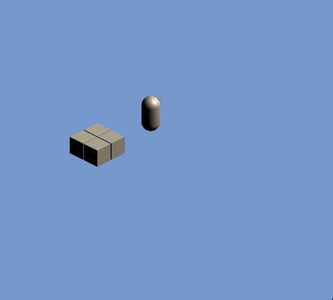
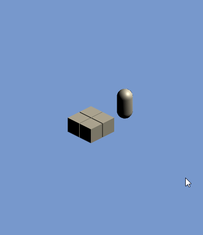

# Log 2

Session Start: `04-06-20 01:48`

Session End: `04-06-20 03:35`

Time: `1:47`

---
# What I Did
Unfortunately, I forgot to commit all of my changes from yesterday :) so [Log1](../Capstone_Logs/Log1.md) and Log2 will be placed under the same commit.

I implemented some of the basic movement for the player, nothing much changed aesthetic-wise and I haven't fully fleshed out the mechanics of the other machines but the overall design and mechanics of the game is concrete, and all I really need to do now is to reify it by putting it onto a design document.

In terms of the player movement, I was aiming to replicate Delayed Auto Shift. While you may be unfamiliar with this term, you may be familiar with what it is. Look at the webpage, at the side, you may see a scrollbar. Instead of using the scroll wheel on your mouse to scroll down or clicking on the bar to move the page down, try holding down the up and down buttons (located at the top and bottom of the scroll bar respectively) or try using the up arrow and down arrow keys on your keyboard to scroll down. You may see the page jerk down, pause then continually scroll down. This effect is known as Delayed Auto Shift. It's when holding down an input causes an intial reaction, then a pause before continuous processing of the input. If you've played Tetris, you may recognize this effect as well.

The player movement code tries to replicate that effect, and does succeed somewhat. This is the 4th iteration of the player movement code and it's the only iteration which is somewhat decent and functioning. The problem comes with distinguishing between a held input and a fast-tapped input. I can't simply put a debounce on the movement code because optimally, if you furiously tap on your W key, your player should move for each key press (hyper-tapping), but if you hold down your W key, the player should move as well, but in discrete time steps. The current iteration solves that problem, but the delay portion of the Delayed Auto Shift isn't something trivial to implement nicely either. As of this session, it can handle hyper-tapping and held-inputs but there isn't a delay quite yet (if you hold down the input, instead of having the intial-pause-continuous, it goes straight to continuous) which makes it quite awkward. Not too excited to work on the 5th iteration, but that's something far down in the priority list. If it works, then it works.

Furious tapping (hyper-tapping) below

Held input below

