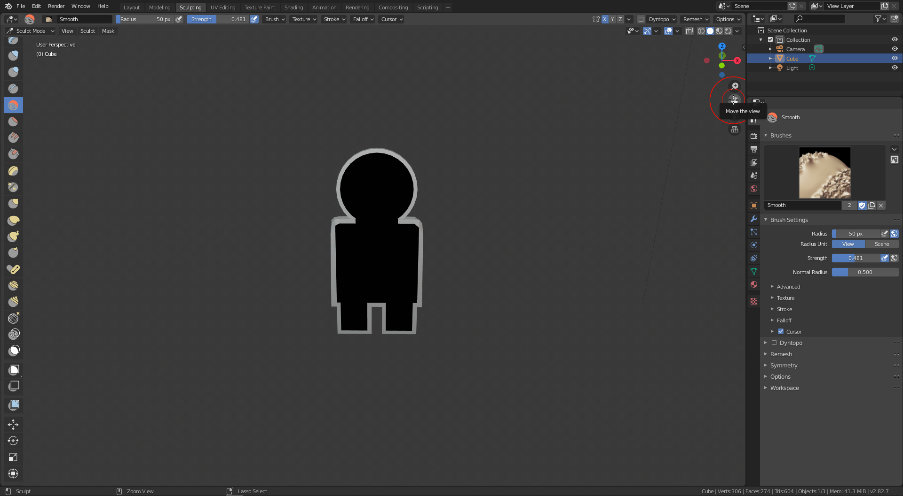

# Log 4

Session Start: `04-09-20 22:06`

Session End: `04-10-20 00:39`

Time: `2:33`

# What I Did
I did some modelling in Blender 2.8.

I've made my first iteration of my player character! Looks awful though.

There really isn't much to describe, Blender is kinda boring when it comes to logging.

Obviously this looks like **GARBAGE**. I'm no Blender master (this _is_ my first time even opening said software). I'll probably take some time soon to actually learn on how to properly navigate and use the software so I can make a player model that is the correct scale and doesn't look terrible! This was mostly just a test to see how the software works and how to integrate exported models into Unity3D.
