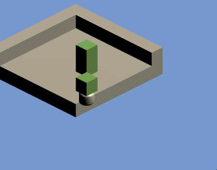
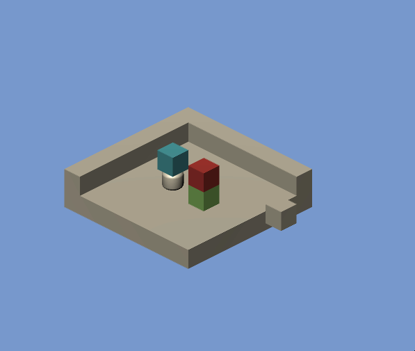
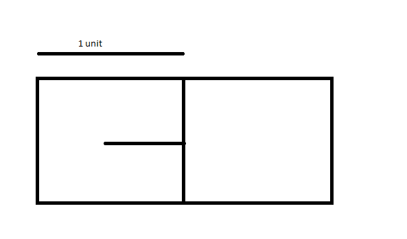
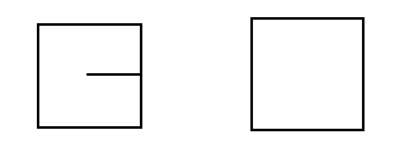
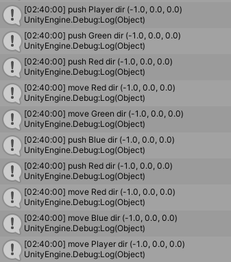
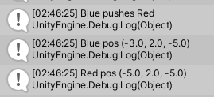

# Log 5


Session Start: `04-12-20 18:42:56`


Session End: `04-13-20 03:33`


Time: `8:50:44` + ` ? ? ? `

# What I Did
I didn't log this part, but I did some learning on Blender so I can actually make not-bad models! I spent an estimated 4 hours on learning the software, but I'm still far from actually being competent at using it. Blender is notorious for its absurdly steep learning curve.

What I did log for today is I spent nearly 9 hours fixing a bug that shouldn't exist, but does.

It's actually two bugs.

But before we actually discuss what bugs are existing but should not be, let's discuss what we accomplished!

I managed to extend the `Pushable` component functionality to allow carrying! If a pushable object `A` is on top of another pushable object `B` like in this diagram
```
---
|A|
---
---
|B|
---
```

If `B` gets pushed, so will `A`, effectively creating an effect of carrying.
```
     ---
     |A|
     ---
   \ ---
---- |B|
   / ---
```

This also means that the player can carry stuff! This also means that batteries can carry stuff! Can a battery, which is being carried by the player, which is being carried by a battery, carry a battery? Of course they can! The system was intentionally coded as such so that there is no theoretical limits to the carrying. The carrying mechanic is coded in the following snippet:
 ```cs
if (allowedToMove)
{
    RaycastHit carryInfo;
    if (Physics.Raycast(raycastOrigin, Vector3.up, out carryInfo, 0.5f))
    {
        GameObject objectCarrying = carryInfo.transform.gameObject;
        PromptPush(objectCarrying, movementVector);
    }

    transform.Translate(movementVector);
}
```

Basically, the code says "if this object is allowed to move (`allowedToMove`), then detect if something is on top of it, and if so, push it in the same direction."

And it works wonders! Carrying does function as is intended! You put stuff on top of some other stuff on top of some other stuff ad infinitum and it'll push all the objects as if they were being carried.

Except this new mechanic introduces a bunch of bad bugs. Disclaimer: I have not yet implemented gravity, so blocks will stay in the same Y-level always.



The bug shown above shows that sometimes (completely random), the carried object gets detached from the carrier and doesn't go with it. I've attempted to fix this bug to no avail because it feels as if I have no control over it; I have tracked the source of error: the code used to detect if something is on top sometimes doesn't work! The line `Physics.Raycast(raycastOrigin, Vector3.up, out carryInfo, 0.5f)` is responsible for detecting whether something is on top or not. Now this is good, I managed to find the source of the bug, the problem comes with the fact that 1) `Physics.Raycast` is a function provided to us by the Unity engine. It is not something I can change. 2) It's inconsistent and completely unpredictable if an object will detach or not. 3) There is no reason for this line to fail at all. That's why this bug stumps me; **it should not exist at all**.



The bug shown above shows that when the player `P`, which is carrying an object `Blue`, pushes an object `Green`, which is also carrying another object `Red`, `Red` appears to travel two units (unintended) compared to `Blue`, `Green` and `P`, which all travel only one unit (intended).

I also know the source of this bug: it's a side effect of how `Pushable` works. `Pushable` can be separated into two mechanics:

1) When an object `A` is carrying another object `B`, `A` tells `B` to execute `Push` when `A` executes `Push`. This would mean that both of them move in tandem.
```
[A]  ------------>  [A]      ------------------->  --> [A]
[B]  B gets pushed  --> [B]  A gets pushed with B  --> [B]
```

2) When an object `C` is adjacent to another object `D` and `C` is pushed towards `D`, `D` will also get pushed. This creates a multi-pushing effect.
```
[C][D]
C gets pushed, C tells D to also get pushed
[C] --> [D]
C moves now that D is out of the way
-->  [C][D]
```

Now we have the bread and butter of the `Pushable` component explained above, the source of the problem comes from a combination of both. In the gif above, `Green` is executing 1) on `Red`, pushing `Red` one unit. This makes sense as this is the intended behaviour. Now that both `Red` and `Green` are out of the way, the player can now move and thus moves. Since the player is also a `Pushable`, the player applies the same mechanics listed above; the player invokes 1) on `Blue`, thus pushing `Blue` in the same direction of the player movement. Here is where the problem lies: `Blue` is now pushed, which means that if certain conditions are met, it will invoke either 1) or 2), and it does meet said certain conditions. `Blue` invokes 2) on `Red`, thus pushing `Red` again for a second time, causing a double push. This results in `Red` travelling two units while all the other entities only travelled one unit.

Here's the problem: 2) only invokes if and only if the two objects are adjacent to each other. `Pushable` again uses `Physics.Raycast` in order to determine whether something is adjacent or not in this line: `Physics.Raycast(raycastOrigin, movementVector, out movementHit, 0.5f)`. Here is a diagram of what that line does



_Fig. 1_

In `Fig. 1`, you can see that both the objects are adjacent to each other, so the raycast (the line) hits and detects correctly.



_Fig. 2_

In `Fig. 2`, you can see that the objects are not adjacent, thus the raycast is not long enough to hit the other block and detects that there is no adjacent objects.

Here is what is happening when the pushing occurs (`push` here means invoking 1) and 2) if conditions are met, `move` here means actually moving)



What we see in the sequence above is that `move Red` occurs before `push Blue`; this means that once `push Blue` is executed, `Red` is not adjacent anymore and thus should not invoke 2). Even the positions of the object that this time-frame agree with that conclusion: `Blue` and `Red` are not adjacent once `push Blue` occurs.



The console window shows that once `push Blue` occurs, `Blue` is located at `(-3, 2, -5)` and `Red` is located at `(-5, 2, -5)`. These vectors are two units apart and should **not** invoke 2). So this bug should also not exist.

Conclusion:
```
     ???????
   ????   ????
 ???         ???
???           ???
???           ???
              ???
             ???
          ????
        ????
       ????
       ????
       ????

       ????
       ????
```

I'm exhausted.
